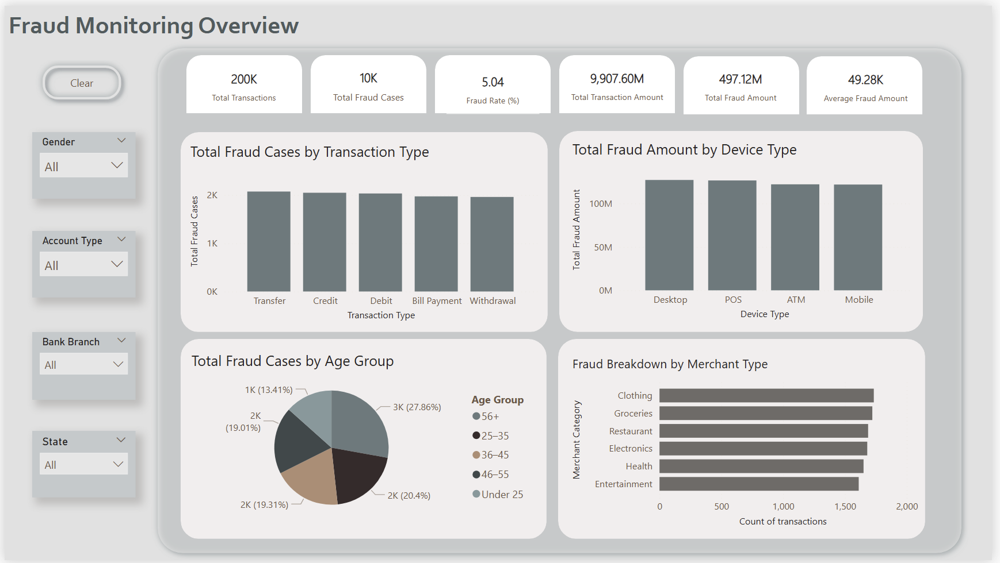

# Bank Transaction Fraud Detection Dashboard

This Power BI project showcases an end-to-end fraud analysis dashboard built for a simulated financial institution, **LOL Bank Pvt. Ltd.** The goal is to provide real-time insights into fraudulent banking activity, enabling proactive detection and strategic monitoring.

## About the Project

With the growing risk of fraud in digital banking, this project focuses on visualizing historical transaction data to identify patterns indicative of suspicious behavior. The interactive dashboard supports fraud analysts and compliance officers in quickly identifying high-risk transactions, users, devices, and merchant types.

### Tools & Technologies
- **Power BI** for data modeling and dashboard development
- **Power Query** for data cleaning and transformation
- **DAX** for custom KPIs and calculated measures

## Key Dashboard Features

- **200K Total Transactions**
- **10K Fraud Cases (5.04% Fraud Rate)**
- **497M in Total Fraud Amount**
- **49.28K Average Fraud per Case**

### Visual Highlights
- **Fraud by Transaction Type** – Compare fraud volumes across transfers, credits, withdrawals, etc.
- **Fraud by Device** – Identify which channels (e.g., ATM, POS, Mobile) are exploited most.
- **Age Group Analysis** – Detect vulnerable customer segments.
- **Merchant Type Breakdown** – Understand which sectors are most targeted.
- **Filter Options** – Dynamically filter by Gender, State, Account Type, and Branch.

## Analysis Approach

- Designed KPIs to monitor fraud rate, total amounts, and transaction volume.
- Created interactive visuals to expose trends by customer profile, transaction method, and merchant type.
- Used conditional formatting and slicers to highlight outliers and enable exploratory investigation.

## Project Structure
## 📁 Project Structure
Power BI Dashboards/  
└── Bank Transaction Fraud Project/  
    ├── Bank Transaction Fraud Detection.pbix   # Full Power BI report  
    ├── [DAX_Calculations.md](./DAX_Calculations.md)   # Key DAX formulas and measures  
    ├── README.md                               # Project description and walkthrough  
    └── dashboard_view.png                      # Screenshot of final dashboard  

## Dataset Summary

Data source: [Bank Transaction Fraud Detection – Kaggle](https://www.kaggle.com/datasets/marusagar/bank-transaction-fraud-detection)
The data simulates real-world bank transactions, including:
- **Customer Info**: Age, Gender, State, Contact
- **Account Details**: Type, Branch, Balance
- **Transactions**: Amount, Time, Type, Device
- **Fraud Label**: Binary flag (`Is_Fraud`) indicating fraud cases

This synthetic dataset was designed for fraud detection model building and analytics use cases.

## Outcome

This dashboard delivers an accessible and insightful interface for fraud detection teams. It highlights fraud trends, supports investigation workflows, and contributes to a proactive fraud prevention strategy for the bank.

## Key Insights & Analyst Relevance

This dashboard highlights several fraud risk trends relevant to roles in compliance and fraud prevention:

- **Consistently high fraud across Transfer, Credit, and Debit transactions** indicates the need for stronger monitoring on digital channels.
- **Device-based risk is evenly distributed**, showing that fraud is not isolated to just mobile or ATM — suggesting cross-platform fraud detection policies are essential.
- **Older customers (56+) account for the largest share of fraud cases (27.86%)**, flagging a vulnerable group that may need targeted awareness campaigns or stricter transaction verification.
- **Fraud occurs across a wide range of merchant types** (e.g., Clothing, Electronics, Restaurants), reinforcing the need for merchant profiling and transaction pattern analysis.
- **The dashboard's dynamic filters** (Gender, State, Account Type, etc.) enable real-time investigative slicing, supporting tasks like root cause analysis, audit response, and targeted compliance reporting.

---
